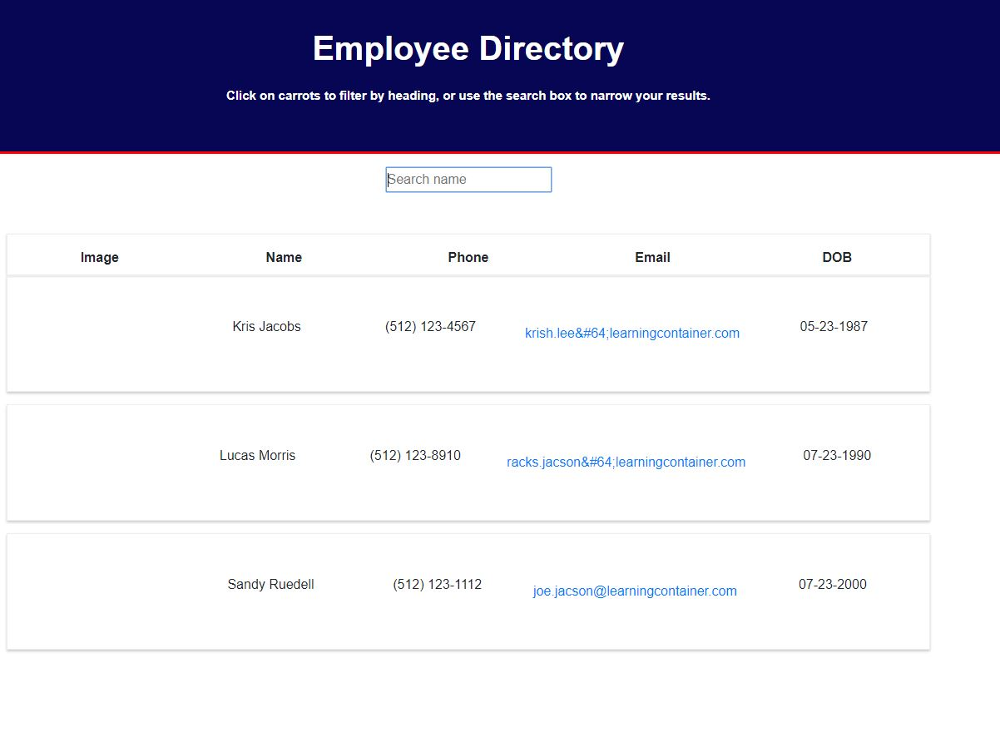
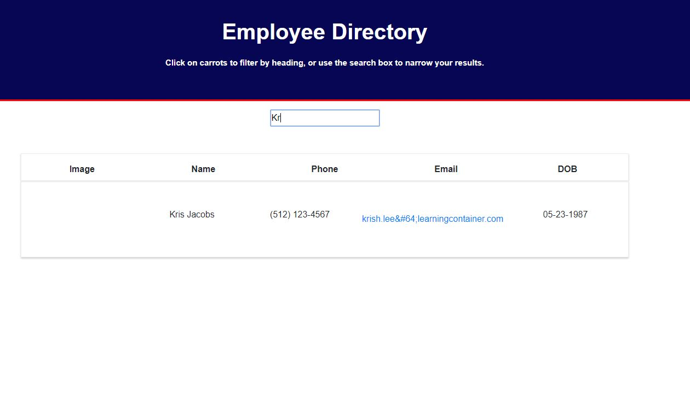
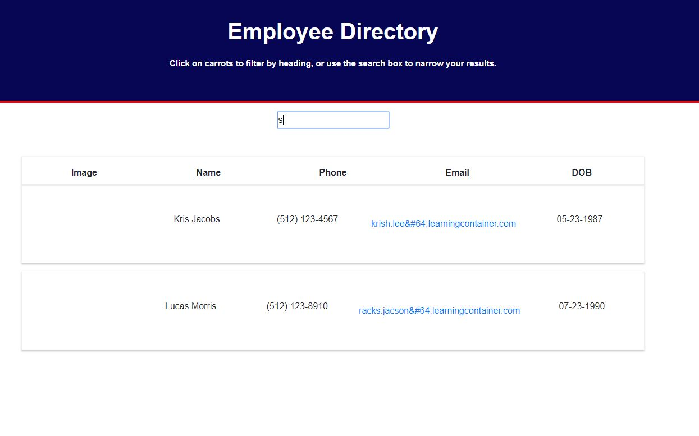

# 19_React_Employee_Directory
19 React Employee Directory Homework

This application requires the use of React for creating individual components, managing component state, and responding to user events.

## User Story

* As a user, I want to be able to view my entire employee directory at once so that I have quick access to their information.

* An employee or manager would benefit greatly from being able to view non-sensitive data about other employees. It would be particularly helpful to be able to filter  employees by name.

 
  
   
  
   
  